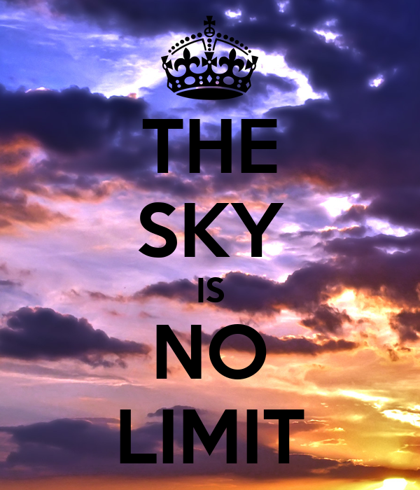
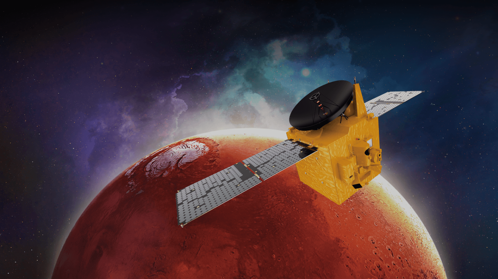
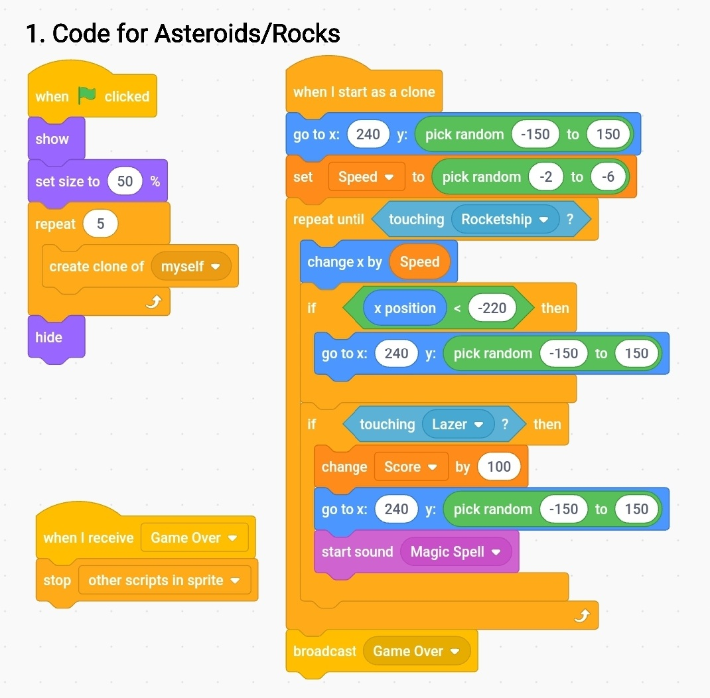

<!DOCTYPE html>
<html>
    <head>
<meta charset="utf-8">
<meta name="viewport" content="width=device-width, initial-scale=1">
    </head>
    <body>
<h1>Sky Is No Limit</h1>
<h3><u>By: Kanek, Harshit & Karan</u></h3>
 

 <href = ">
As our topic is <b><i><a Hope Probe Misssion'</a></i></b>

<b>What have we made?</b>  >We made an <a href="https://scratch.mit.edu/projects/582706783"target="_blank">Spaceship Game</a> by scratch coding.

<b>How is our game related to the theme 'Sky is no Limit'?</b> >Our game spaceship shoots miscle's to the rocks who act as an obstacle, this tells that we have to break through every obstacle in our way.

What is <b>'Mission Hope Probe'</b> and how is it related to <b>'Sky Is No Limit'</b>? >The Emirates Mars Mission is a United Arab Emirates Space Agency uncrewed space exploration mission to Mars. The Hope orbiter was launched on 19 July 2020, and went into orbit around Mars on 9 February 2021. The mission design, development, and operations are led by the Mohammed bin Rashid Space Centre. Hope Probe mission is related to the theme by:   <ol>
       <li>Sky is no limit means there can be nothing that can stop you. Mission Hope Probe has also proved that sky is no longer the limit, Hope Probe is the first satelite to get clear weather information of mars and it's atmosphere.</li>
</ol>

<h2>Game Instructions & Link: https://scratch.mit.edu/projects/582706783 </h2>
<h2>Our Scratch Code For the Game</h2>
 
  
  
  
</body>
</html>
  
